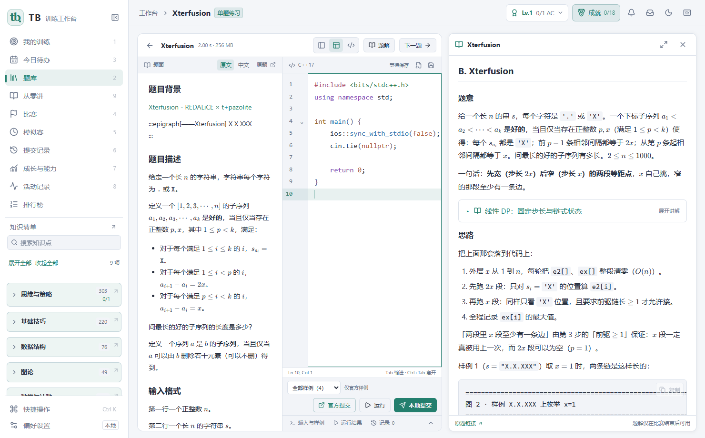

# TB · 训练工作台

**把题库、题解、代码编辑、本地评测和训练记录放在一个工作台里。**

TB 面向算法竞赛训练，支持牛客、Codeforces、AtCoder 和洛谷。题库与题解随安装包提供，训练记录留在本机；公开账号同步、机器翻译和共享排行榜按需联网。

[下载桌面版](https://github.com/3097729287/acm-agent-workflow/releases) · [使用说明](docs/usage.md) · [开发与构建](docs/development.md) · [English](README.en.md) · [反馈问题](https://github.com/3097729287/acm-agent-workflow/issues)



## 开始使用

Windows 10/11 64 位用户下载 Release 中的 `TB-Setup-<版本>-win64.exe` 并安装。完整安装包包含 Python 运行时、C++ 编译器和离线 WebView2 安装组件。便携包需要完整解压，系统须已有 WebView2；不要只复制一个 EXE。

选择题目，加入训练，在编辑器里写 C++。**运行**检查样例；**本地提交**使用该题已有的评测数据；**官方提交**在原站面板登录并提交。三种结果分别记录，样例通过不会被当成完整通过。

## 工作台里有什么

| 功能 | 行为 |
| --- | --- |
| 题库与题解 | 当前内置 607 道题、607 份题解和 378 篇基础讲解，使用 SQLite 储存；不依赖开发者的归档目录 |
| 练习与模拟赛 | 单题、综合与专项训练；比赛中隐藏知识点，结束后复盘 |
| 代码与记录 | 自动保存草稿、提交代码与结果；训练进度由实际提交产生 |
| 知识清单 | 分组标题、层级缩进、连接线和覆盖统计，支持搜索与键盘操作 |
| 成长与能力 | 能力参考、推荐题目和每日任务卡片；奖励按不同题目的实际通过计算 |
| 公开账号 | 同步支持平台的公开资料和通过记录，注明数据来源 |
| 题面翻译 | DeepSeek、火山方舟及自定义兼容 API，支持连接测试，保护代码、公式和样例 |
| 共享排行榜 | 默认连接已部署的 [TB 服务](https://tb-leaderboard.fsxxxg.workers.dev/)，按北京时间统计日榜、周榜与总榜 |

新同步的公开题可能尚无题解。只有内置或导入了题解的题目显示“可读题解”。本题的基础讲解只关联自己的讲解章节及明确引用，不会把同标签的全部讲义列出来。

## 项目结构

```text
frontend/           React 界面，独立开发与构建
backend/            本机 HTTP API、SQLite 存储、训练与评测服务
backend/resources/  标准知识点和公开来源配置
desktop/           桌面窗口及官方提交适配
data/              随包分发的公共 library.sqlite3
server/leaderboard/ Cloudflare Worker + D1 共享排行服务
scripts/           内容导入、检查与构建
packaging/         Windows 安装程序
docs/              使用、架构、开发与迁移说明
```

前后端通过 `/api` 通信。后端不要求界面文件即可启动；开发时 Vite 代理 API，桌面版由宿主组合已构建的界面与本机服务。

## 数据与升级

内置题库位于 `data/library.sqlite3`。运行时数据位于 `state/`：题库工作副本、个人训练数据库和设置文档数据库彼此独立。升级更新公共题库，保留个人记录、身份、加密配置和用户导入内容；写入前会备份已有题库。

0.5 版本的 SQLite 个人记录直接沿用，JSON 配置在首次使用时迁入 SQLite，源文件保留。安装程序可显式导入旧 DSH 安装的记录。详见 [数据与迁移](docs/architecture.md#数据与迁移)。

## 开发

需要 Python 3.13、Node.js 24 和可用的 C++ 编译器。

```powershell
python backend/backend.py --offline
# 另一个终端
cd frontend
npm ci
npm run dev
```

后端默认 `127.0.0.1:18765`，前端默认 `127.0.0.1:5173`。桌面开发另装 `backend/requirements.txt` 中的依赖，构建界面后运行 `python desktop/launch.py`。完整命令见 [开发说明](docs/development.md)。

```powershell
python scripts/check.py
cd frontend
npm run build
npm run test:ui
npm run test:compilers
```

[排行榜部署](server/leaderboard/README.md) · [贡献说明](CONTRIBUTING.md) · [MIT](LICENSE) · [第三方许可](THIRDPARTY.md)

GitHub 仓库地址保留 `acm-agent-workflow`，项目的主产品和公开介绍已转为 TB。
